# 🗄️ One World Visa - Database Design

> **Complete Database Schema and Entity Relationship Diagrams**

This document contains the comprehensive database design for the One World Visa management system, including all collections, relationships, and data models.

---

## 📋 **Table of Contents**

1. [Database Overview](#database-overview)
2. [Entity Relationship Diagram](#entity-relationship-diagram)
3. [Collection Schemas](#collection-schemas)
4. [Data Relationships](#data-relationships)
5. [Indexes and Performance](#indexes-and-performance)
6. [Security Considerations](#security-considerations)

---

## **Database Overview**

### **Database Technology**: MongoDB (NoSQL)
### **Total Collections**: 20
### **Key Features**:
- Document-based storage
- Flexible schema design
- Embedded documents for performance
- Reference relationships for data integrity
- Compound indexes for query optimization

---

## **Entity Relationship Diagram**

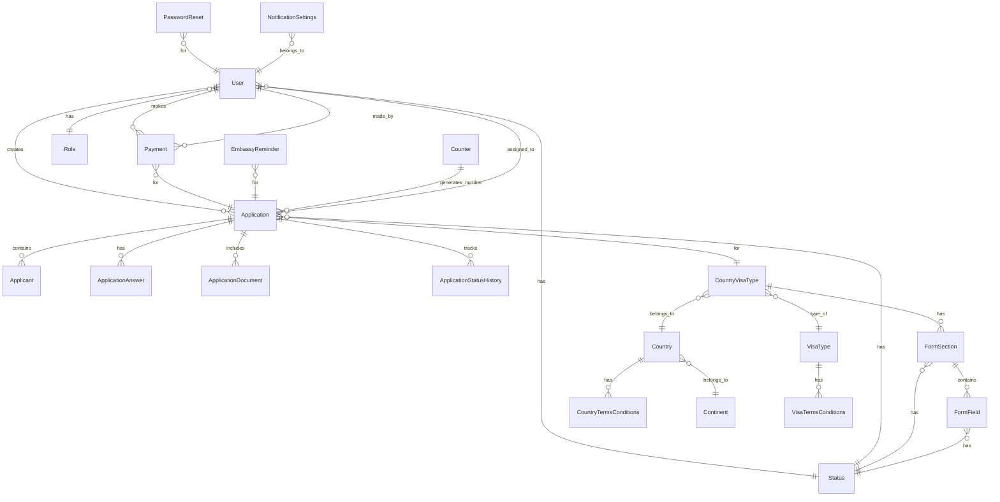

---

## **Collection Schemas**

### **1. Users Collection**

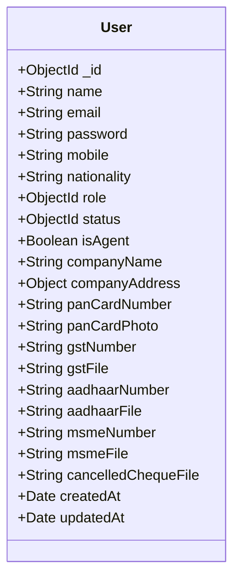

### **2. Applications Collection**

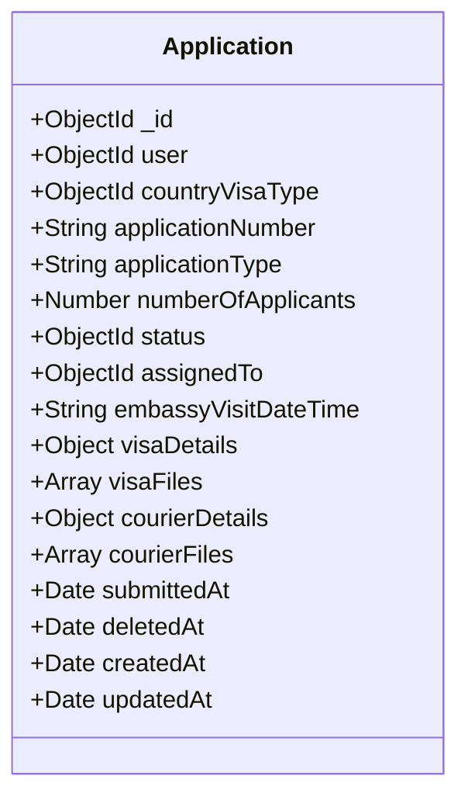

### **3. Roles Collection**

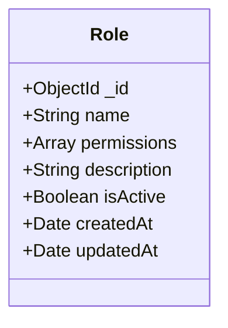

### **4. Countries Collection**

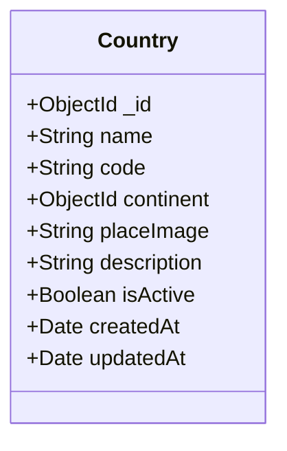

### **5. Visa Types Collection**

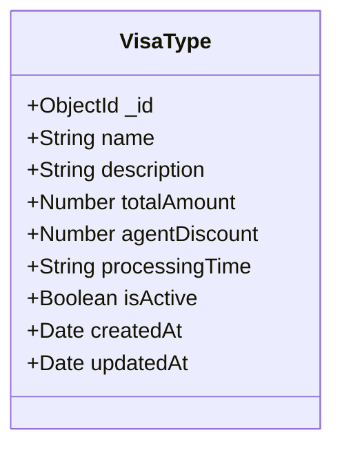

### **6. Form Sections Collection**

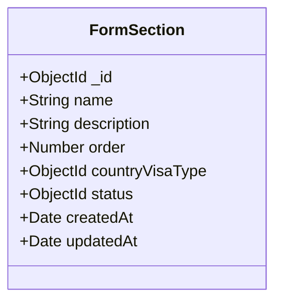

### **7. Form Fields Collection**

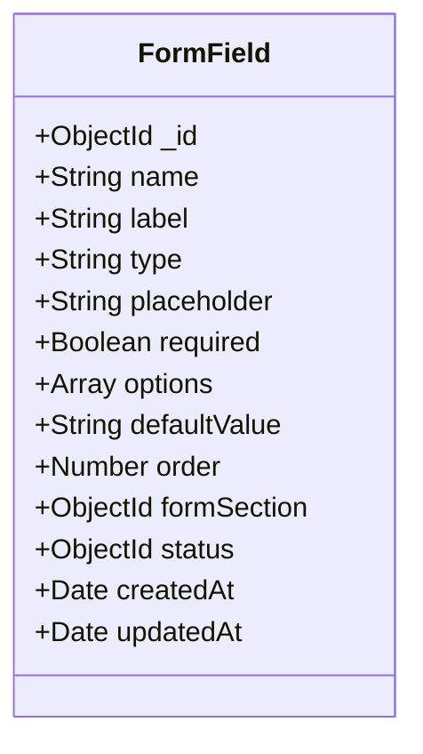

### **8. Payments Collection**

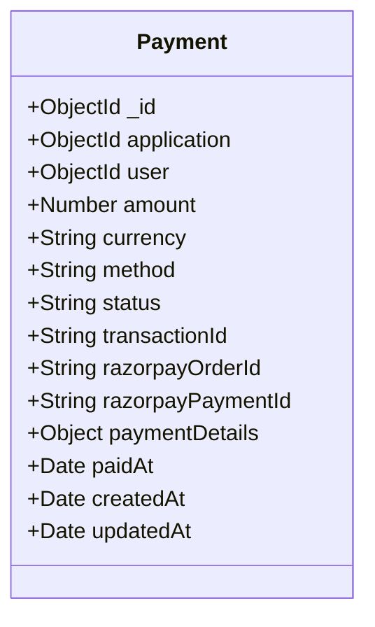

---

## **Data Relationships**

### **User-Centric Relationships**

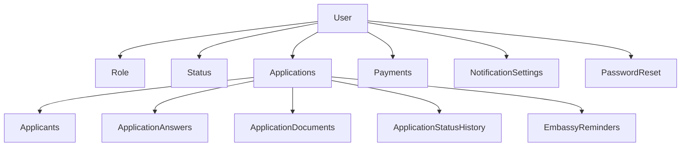

### **Application-Centric Relationships**

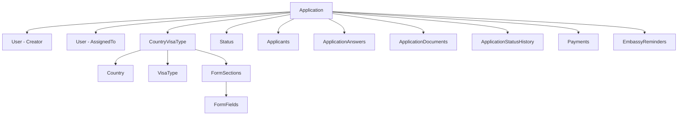

### **Form Builder Relationships**

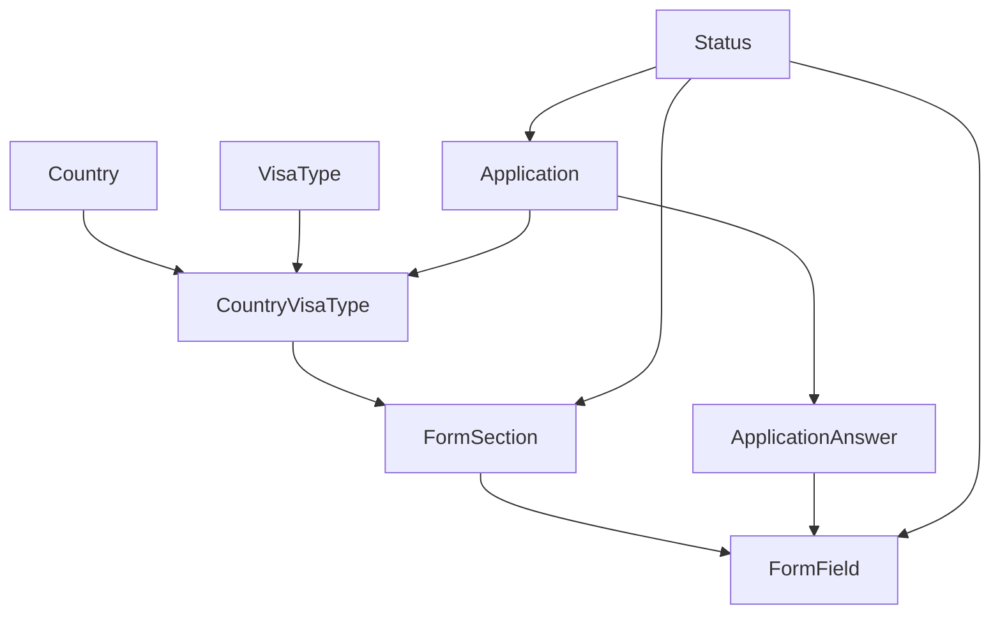

---

## **Database Schema Details**

### **Core Collections**

#### **Users**
```javascript
{
  _id: ObjectId,
  name: String,
  email: String (unique, indexed),
  password: String (hashed),
  mobile: String,
  nationality: String,
  role: ObjectId (ref: Role),
  status: ObjectId (ref: Status),
  
  // Agent-specific fields
  isAgent: Boolean,
  companyName: String,
  companyAddress: {
    line1: String,
    line2: String,
    city: String,
    pin: String,
    state: String,
    country: String
  },
  panCardNumber: String,
  panCardPhoto: String,
  gstNumber: String,
  gstFile: String,
  aadhaarNumber: String,
  aadhaarFile: String,
  msmeNumber: String,
  msmeFile: String,
  cancelledChequeFile: String,
  
  createdAt: Date,
  updatedAt: Date
}
```

#### **Applications**
```javascript
{
  _id: ObjectId,
  user: ObjectId (ref: User),
  countryVisaType: ObjectId (ref: CountryVisaType),
  applicationNumber: String (unique, auto-generated),
  applicationType: String (enum: individual, family, group),
  numberOfApplicants: Number,
  status: ObjectId (ref: Status),
  assignedTo: ObjectId (ref: User),
  embassyVisitDateTime: String,
  
  visaDetails: {
    visaNumber: String,
    dateOfIssuance: Date,
    dateOfExpiry: Date,
    additionalDetails: String
  },
  
  visaFiles: [{
    filename: String,
    originalName: String,
    path: String,
    size: Number,
    uploadedAt: Date
  }],
  
  courierDetails: {
    visaNumber: String,
    courierName: String,
    shipmentRefNumber: String,
    shipmentDate: Date
  },
  
  courierFiles: [{
    filename: String,
    originalName: String,
    path: String,
    size: Number,
    uploadedAt: Date
  }],
  
  submittedAt: Date,
  deletedAt: Date,
  createdAt: Date,
  updatedAt: Date
}
```

#### **CountryVisaType**
```javascript
{
  _id: ObjectId,
  country: ObjectId (ref: Country),
  visaType: ObjectId (ref: VisaType),
  isActive: Boolean,
  createdAt: Date,
  updatedAt: Date
}
```

### **Form Builder Collections**

#### **FormSections**
```javascript
{
  _id: ObjectId,
  name: String,
  description: String,
  order: Number,
  countryVisaType: ObjectId (ref: CountryVisaType),
  status: ObjectId (ref: Status),
  createdAt: Date,
  updatedAt: Date
}
```

#### **FormFields**
```javascript
{
  _id: ObjectId,
  name: String,
  label: String,
  type: String (enum: text, email, number, select, checkbox, radio, file, textarea),
  placeholder: String,
  required: Boolean,
  options: [String],
  defaultValue: String,
  order: Number,
  formSection: ObjectId (ref: FormSection),
  status: ObjectId (ref: Status),
  createdAt: Date,
  updatedAt: Date
}
```

### **Application Data Collections**

#### **Applicants**
```javascript
{
  _id: ObjectId,
  application: ObjectId (ref: Application),
  relationship: String,
  order: Number,
  createdAt: Date,
  updatedAt: Date
}
```

#### **ApplicationAnswers**
```javascript
{
  _id: ObjectId,
  application: ObjectId (ref: Application),
  applicant: ObjectId (ref: Applicant),
  formField: ObjectId (ref: FormField),
  answer: Mixed, // String, Number, Array, Object
  createdAt: Date,
  updatedAt: Date
}
```

#### **ApplicationDocuments**
```javascript
{
  _id: ObjectId,
  application: ObjectId (ref: Application),
  applicant: ObjectId (ref: Applicant),
  formField: ObjectId (ref: FormField),
  filename: String,
  originalName: String,
  path: String,
  size: Number,
  mimetype: String,
  uploadedAt: Date,
  createdAt: Date,
  updatedAt: Date
}
```

---

## **Indexes and Performance**

### **Primary Indexes**
```javascript
// Users Collection
db.users.createIndex({ "email": 1 }, { unique: true })
db.users.createIndex({ "role": 1 })
db.users.createIndex({ "status": 1 })
db.users.createIndex({ "isAgent": 1 })

// Applications Collection
db.applications.createIndex({ "applicationNumber": 1 }, { unique: true })
db.applications.createIndex({ "user": 1 })
db.applications.createIndex({ "status": 1 })
db.applications.createIndex({ "assignedTo": 1 })
db.applications.createIndex({ "countryVisaType": 1 })
db.applications.createIndex({ "createdAt": -1 })

// Compound Indexes
db.applications.createIndex({ "user": 1, "status": 1 })
db.applications.createIndex({ "assignedTo": 1, "status": 1 })
db.applications.createIndex({ "countryVisaType": 1, "status": 1 })

// Form Collections
db.formsections.createIndex({ "countryVisaType": 1, "order": 1 })
db.formfields.createIndex({ "formSection": 1, "order": 1 })

// Application Data
db.applicationanswers.createIndex({ "application": 1, "applicant": 1 })
db.applicationdocuments.createIndex({ "application": 1, "applicant": 1 })

// Payments
db.payments.createIndex({ "application": 1 })
db.payments.createIndex({ "user": 1 })
db.payments.createIndex({ "transactionId": 1 })
```

### **Text Search Indexes**
```javascript
// Full-text search capabilities
db.users.createIndex({ 
  "name": "text", 
  "email": "text", 
  "companyName": "text" 
})

db.applications.createIndex({ 
  "applicationNumber": "text" 
})

db.countries.createIndex({ 
  "name": "text", 
  "description": "text" 
})
```

---

## **Data Validation Rules**

### **User Validation**
```javascript
{
  $jsonSchema: {
    bsonType: "object",
    required: ["name", "email", "password", "role", "status"],
    properties: {
      name: { bsonType: "string", minLength: 2, maxLength: 100 },
      email: { bsonType: "string", pattern: "^[a-zA-Z0-9._%+-]+@[a-zA-Z0-9.-]+\.[a-zA-Z]{2,}$" },
      mobile: { bsonType: "string", pattern: "^[0-9]{10}$" },
      isAgent: { bsonType: "bool" }
    }
  }
}
```

### **Application Validation**
```javascript
{
  $jsonSchema: {
    bsonType: "object",
    required: ["user", "countryVisaType", "applicationType", "numberOfApplicants", "status"],
    properties: {
      applicationType: { enum: ["individual", "family", "group"] },
      numberOfApplicants: { bsonType: "int", minimum: 1, maximum: 10 },
      applicationNumber: { bsonType: "string", pattern: "^OWV-[0-9]{7}$" }
    }
  }
}
```

---

## **Security Considerations**

### **Data Encryption**
- **Passwords**: bcrypt hashing with salt rounds
- **Sensitive Files**: Server-side encryption
- **Database**: MongoDB encryption at rest
- **Transmission**: TLS/SSL encryption

### **Access Control**
- **Role-based permissions**: Granular access control
- **Field-level security**: Sensitive data protection
- **Audit logging**: Complete activity tracking
- **Data masking**: PII protection in logs

### **Backup Strategy**
- **Daily backups**: Automated MongoDB dumps
- **Point-in-time recovery**: Transaction log backups
- **Geographic redundancy**: Multi-region backups
- **Retention policy**: 30-day backup retention

---

## **Performance Optimization**

### **Query Optimization**
- **Projection**: Return only required fields
- **Aggregation**: Use MongoDB aggregation pipeline
- **Pagination**: Implement cursor-based pagination
- **Caching**: Redis for frequently accessed data

### **Connection Management**
- **Connection pooling**: Mongoose connection pool
- **Read preferences**: Secondary reads for analytics
- **Write concerns**: Appropriate consistency levels
- **Monitoring**: Database performance metrics

---

## **Migration Scripts**

### **Initial Setup**
```javascript
// Create collections with validation
db.createCollection("users", { validator: userValidationSchema })
db.createCollection("applications", { validator: applicationValidationSchema })

// Create indexes
db.users.createIndex({ "email": 1 }, { unique: true })
db.applications.createIndex({ "applicationNumber": 1 }, { unique: true })

// Seed initial data
db.roles.insertMany([
  { name: "admin", permissions: ["*"], isActive: true },
  { name: "manager", permissions: ["read", "write"], isActive: true },
  { name: "employee", permissions: ["read"], isActive: true },
  { name: "customer", permissions: ["read_own"], isActive: true },
  { name: "agent", permissions: ["read_own", "write_own"], isActive: true }
])

db.statuses.insertMany([
  { name: "active", description: "Active status" },
  { name: "inactive", description: "Inactive status" },
  { name: "pending", description: "Pending approval" },
  { name: "submitted", description: "Application submitted" },
  { name: "processing", description: "Under processing" },
  { name: "approved", description: "Application approved" },
  { name: "rejected", description: "Application rejected" }
])
```

---

## 📊 **Database Statistics**

### **Collection Sizes (Estimated)**
- **Users**: ~10,000 documents
- **Applications**: ~50,000 documents
- **ApplicationAnswers**: ~500,000 documents
- **ApplicationDocuments**: ~200,000 documents
- **Payments**: ~30,000 documents
- **FormFields**: ~500 documents
- **FormSections**: ~100 documents

### **Storage Requirements**
- **Documents**: ~2GB
- **Files**: ~50GB (uploaded documents)
- **Indexes**: ~500MB
- **Total**: ~52.5GB

---

## 📞 **Support**

For database-related questions:
- **Email**: visas@oneworldvisa.in
- **Phone**: +91 9167447700
- **Documentation**: https://docs.oneworldvisa.in/database

---

**© 2025 One World Visa. All rights reserved.**