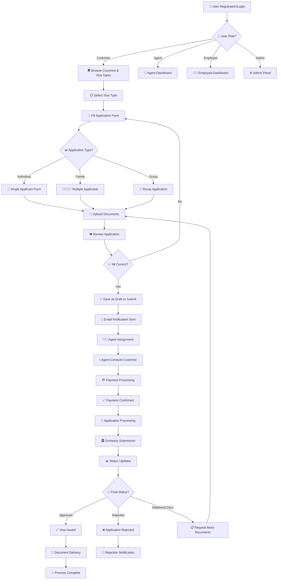
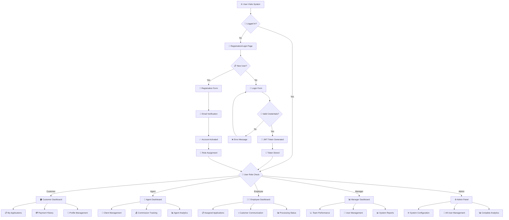
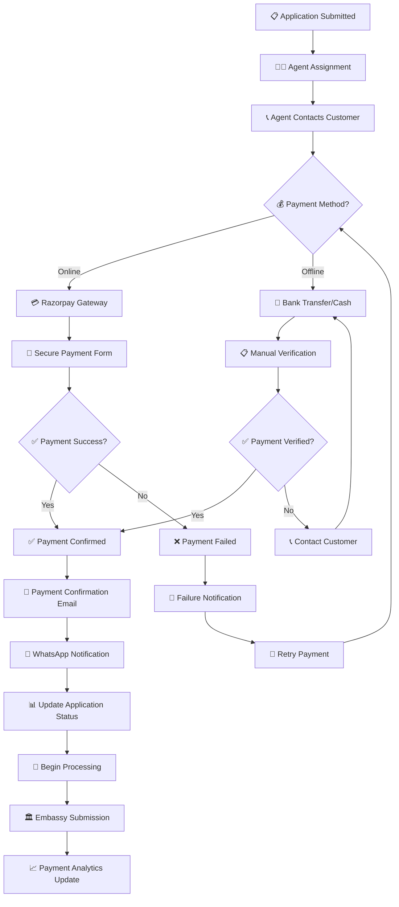
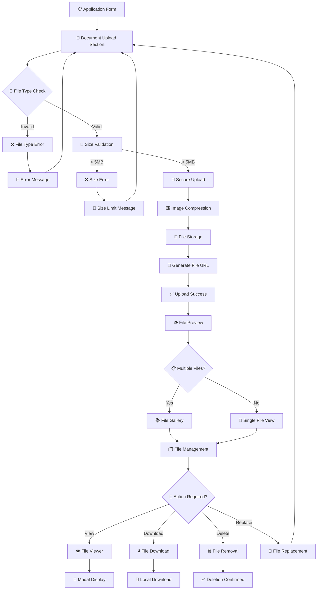
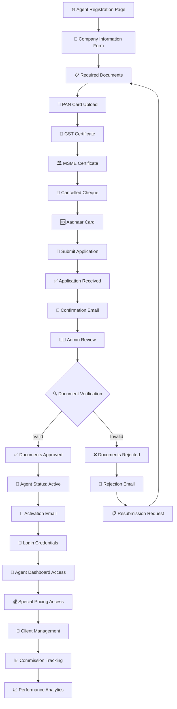
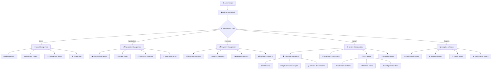
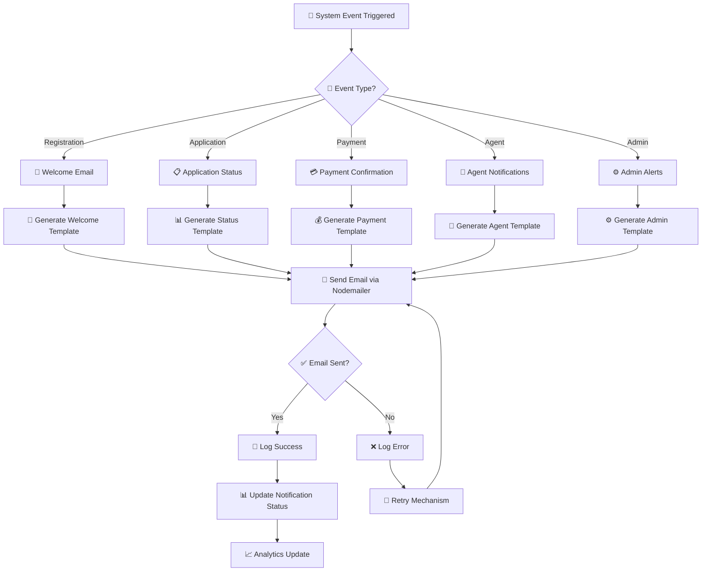
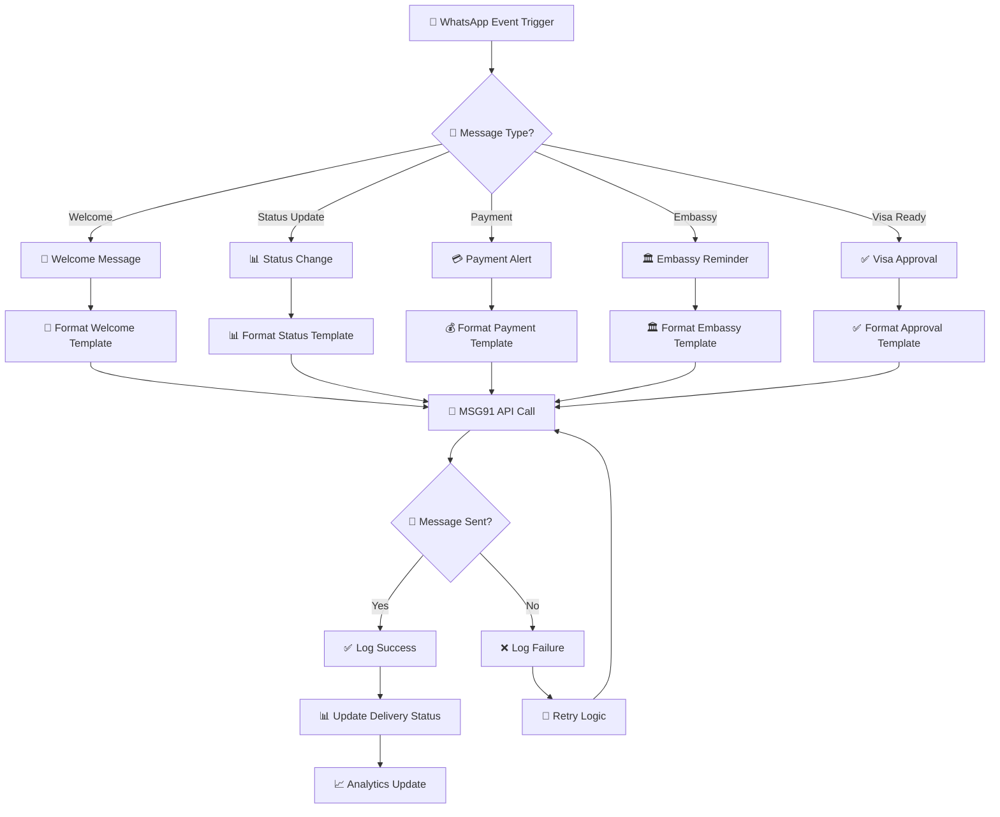
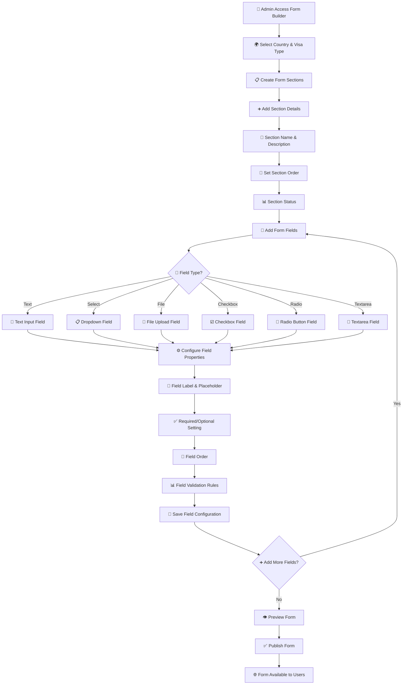
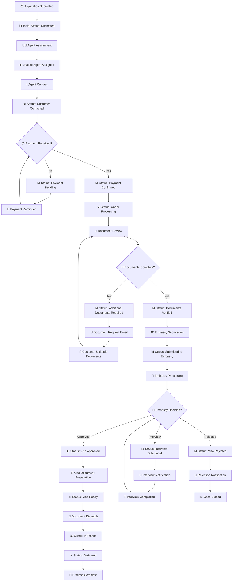

# 🔄 One World Visa - System Flowcharts

> **Complete Visual Guide to System Workflows and Processes**

This document contains comprehensive flowcharts for the One World Visa management system, covering all major workflows and user interactions.

---

## 📋 **Table of Contents**

1. [Complete Application Workflow](#1-complete-application-workflow)
2. [User Authentication & Role Management](#2-user-authentication--role-management-flow)
3. [Payment Processing Flow](#3-payment-processing-flow)
4. [Document Management Flow](#4-document-management-flow)
5. [Agent Registration & Management](#5-agent-registration--management-flow)
6. [Admin System Management](#6-admin-system-management-flow)
7. [Email Notification System](#7-email-notification-system-flow)
8. [WhatsApp Integration Flow](#8-whatsapp-integration-flow)
9. [Form Builder Workflow](#9-form-builder-workflow)
10. [Status Management System](#10-status-management-system)

---

## **1. Complete Application Workflow**

---

## **2. User Authentication & Role Management Flow**

---

## **3. Payment Processing Flow**

---

## **4. Document Management Flow**

---

## **5. Agent Registration & Management Flow**

---

## **6. Admin System Management Flow**

---

## **7. Email Notification System Flow**

---

## **8. WhatsApp Integration Flow**

---

## **9. Form Builder Workflow**

---

## **10. Status Management System**

---

## 📊 **Flowchart Legend**

### **Symbols Used**
- **🔐** - Authentication/Security
- **👤** - User/Person
- **📋** - Forms/Applications
- **💳** - Payments
- **📧** - Email Notifications
- **📱** - WhatsApp/SMS
- **🏛️** - Embassy/Government
- **⚙️** - System/Admin
- **📊** - Status/Analytics
- **🔄** - Process/Workflow
- **✅** - Success/Approval
- **❌** - Error/Rejection
- **🎯** - Decision Point
- **📎** - Documents/Files

### **Color Coding**
- **Green Paths** - Success flows
- **Red Paths** - Error/rejection flows
- **Blue Paths** - Information/status flows
- **Orange Paths** - Action required flows

---

## 🎯 **Usage Instructions**

1. **For Developers** - Use these flowcharts to understand system logic and implementation requirements
2. **For Business Users** - Reference these flows to understand process steps and user journeys
3. **For Training** - Use as visual aids for onboarding new team members
4. **For Documentation** - Include in technical specifications and user manuals
5. **For Stakeholders** - Present system capabilities and process flows

---

## 📞 **Support**

For questions about these flowcharts or system processes:
- **Email**: support@oneworldvisa.in
- **Phone**: +91 9167447700
- **Documentation**: https://docs.oneworldvisa.in

---

**© 2025 One World Visa. All rights reserved.**