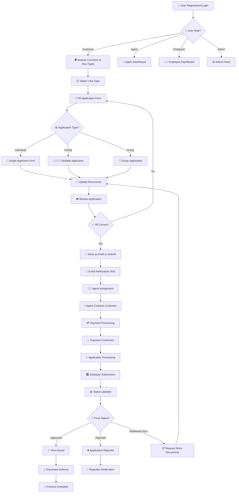
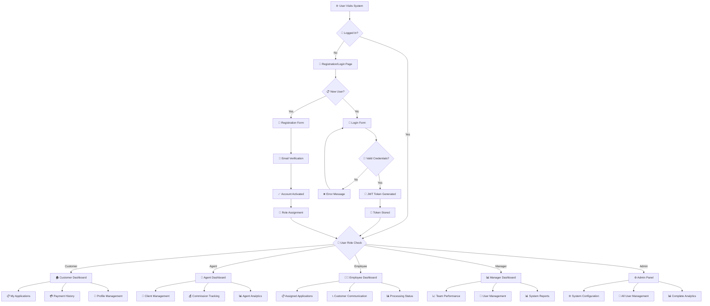
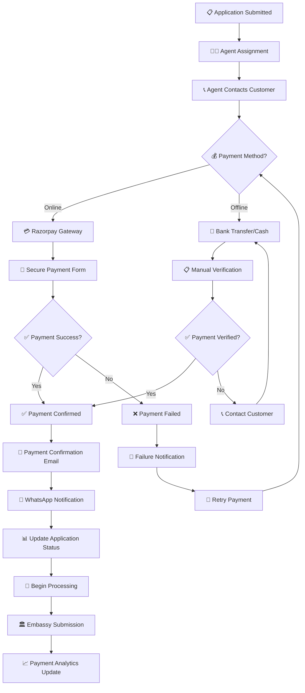
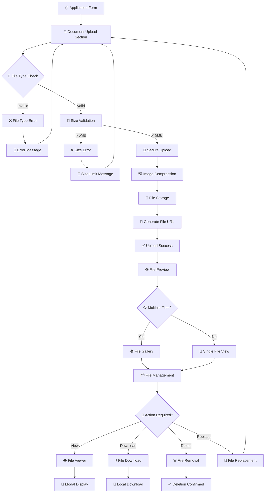
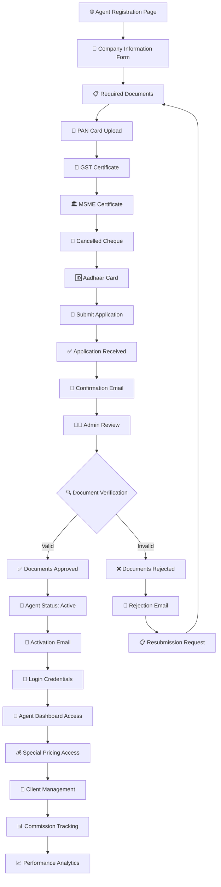
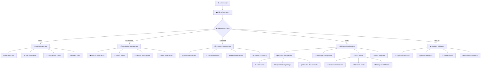

# 🌍 One World Visa - Complete Visa Management System

> **Trusted Visa Assistance for Global Travel Needs**

A comprehensive, enterprise-grade visa application management system built with modern web technologies. Streamline your visa processing workflow with role-based access control, automated notifications, payment integration, and real-time tracking.

[](https://nextjs.org/)
[](https://nodejs.org/)
[](https://mongodb.com/)
[](https://reactjs.org/)
[](https://tailwindcss.com/)

---

## 🚀 **Key Features**

### 🔐 **Advanced Authentication & Security**
- **JWT-based Authentication** with access & refresh tokens
- **Role-Based Access Control (RBAC)** - Admin, Manager, Employee, Customer, Agent
- **Password Reset** with secure token-based system
- **Session Management** with automatic token refresh
- **Protected Routes** on both frontend and backend

### 👥 **Multi-Role User Management**
- **Customer Portal** - Apply for visas, track applications, manage payments
- **Agent System** - Partner registration with document verification
- **Employee Dashboard** - Process applications, update statuses
- **Manager Interface** - Oversee operations, manage users
- **Admin Panel** - Complete system control and analytics

### 📋 **Dynamic Visa Application System**
- **Form Builder** - Create custom forms for different visa types
- **Multi-Applicant Support** - Individual, Family, and Group applications
- **Document Upload** - Multiple file support with compression
- **Draft System** - Save and resume applications
- **Real-time Validation** - Ensure data accuracy before submission

### 💳 **Payment Integration**
- **Razorpay Integration** - Secure payment processing
- **Agent Pricing** - Special rates for registered agents
- **Payment Tracking** - Complete transaction history
- **Multiple Payment Methods** - Cards, UPI, Net Banking

### 📧 **Automated Communication**
- **Email Notifications** - Professional templates for all stages
- **WhatsApp Integration** - MSG91 API for instant updates
- **Status Updates** - Real-time notifications to customers
- **Embassy Reminders** - Automated appointment notifications

### 📊 **Analytics & Reporting**
- **Real-time Dashboard** - Live statistics and metrics
- **Professional Charts** - Application trends and analytics
- **Performance Tracking** - Success rates and processing times
- **Export Capabilities** - CSV reports for data analysis

### 🌐 **Geographic Management**
- **Country Management** - Comprehensive country database
- **Visa Types** - Multiple visa categories per country
- **Terms & Conditions** - Country-specific requirements
- **Embassy Integration** - Appointment scheduling system

---

## 🛠️ **Technology Stack**

### **Backend Technologies**
| Technology | Version | Purpose |
|------------|---------|---------|
| **Node.js** | 18+ | Server runtime environment |
| **Express.js** | 4.18+ | Web application framework |
| **MongoDB** | 7.0+ | NoSQL database |
| **Mongoose** | 7.5+ | MongoDB object modeling |
| **JWT** | 9.0+ | Authentication tokens |
| **bcryptjs** | 2.4+ | Password hashing |
| **Multer** | 2.0+ | File upload handling |
| **Sharp** | 0.34+ | Image processing & compression |
| **Nodemailer** | 6.9+ | Email service |
| **Razorpay** | 2.9+ | Payment gateway |
| **Node-cron** | 3.0+ | Scheduled tasks |

### **Frontend Technologies**
| Technology | Version | Purpose |
|------------|---------|---------|
| **Next.js** | 13.5+ | React framework |
| **React** | 18.2+ | UI library |
| **TailwindCSS** | 3.3+ | Utility-first CSS |
| **Axios** | 1.5+ | HTTP client |
| **Lucide React** | 0.544+ | Icon library |
| **React Hot Toast** | 2.6+ | Notifications |
| **PDFMake** | 0.2+ | PDF generation |
| **React Beautiful DnD** | 13.1+ | Drag & drop |

### **Third-Party Integrations**
- **MSG91** - WhatsApp messaging service
- **Razorpay** - Payment processing
- **Nodemailer** - Email delivery
- **Sharp** - Image optimization
- **JSON2CSV** - Data export

---

## 🏗️ **System Architecture**

```
┌─────────────────┐    ┌─────────────────┐    ┌─────────────────┐
│   Frontend      │    │   Backend API   │    │   Database      │
│   (Next.js)     │◄──►│   (Express.js)  │◄──►│   (MongoDB)     │
│                 │    │                 │    │                 │
│ • React Pages   │    │ • REST APIs     │    │ • Collections   │
│ • Components    │    │ • Middleware    │    │ • Indexes       │
│ • Context API   │    │ • Controllers   │    │ • Aggregations  │
│ • TailwindCSS   │    │ • Services      │    │ • Transactions  │
└─────────────────┘    └─────────────────┘    └─────────────────┘
         │                       │                       │
         ▼                       ▼                       ▼
┌─────────────────┐    ┌─────────────────┐    ┌─────────────────┐
│ External APIs   │    │ File Storage    │    │ Email/SMS       │
│                 │    │                 │    │                 │
│ • Razorpay      │    │ • Image Upload  │    │ • Nodemailer    │
│ • MSG91         │    │ • Compression   │    │ • MSG91 API     │
│ • Payment APIs  │    │ • File Serving  │    │ • Templates     │
└─────────────────┘    └─────────────────┘    └─────────────────┘
```

---

## 📱 **User Interfaces**

### **Customer Portal**
- **Dashboard** - Application overview and status tracking
- **Visa Application** - Step-by-step application process
- **Document Upload** - Secure file management
- **Payment Gateway** - Integrated payment processing
- **Application Tracking** - Real-time status updates
- **Profile Management** - Personal information control

### **Agent Interface**
- **Registration System** - Partner onboarding with verification
- **Special Pricing** - Discounted rates for agents
- **Client Management** - Handle multiple customer applications
- **Commission Tracking** - Earnings and payment history
- **Document Verification** - GST, PAN, MSME validation

### **Employee Dashboard**
- **Application Processing** - Review and update applications
- **Status Management** - Track application lifecycle
- **Customer Communication** - Direct contact capabilities
- **Document Review** - Verify uploaded documents
- **Embassy Coordination** - Schedule appointments

### **Admin Panel**
- **User Management** - Complete user control
- **System Analytics** - Comprehensive reporting
- **Form Builder** - Create custom application forms
- **Country Management** - Visa types and requirements
- **Payment Oversight** - Transaction monitoring
- **System Configuration** - Settings and preferences

---

## 🔄 **System Workflows & Flowcharts**

### **1. Complete Application Workflow**



### **2. User Authentication & Role Management Flow**



### **3. Payment Processing Flow**



### **4. Document Management Flow**



### **5. Agent Registration & Management Flow**



### **6. Admin System Management Flow**



---

## 🎯 **Role-Based Permissions**

| Feature | Admin | Manager | Employee | Agent | Customer |
|---------|-------|---------|----------|-------|----------|
| **Dashboard** | ✅ Full | ✅ Full | ❌ Limited | ✅ Full | ✅ View |
| **User Management** | ✅ Full | ✅ Add/Edit | 👥 Customers | ❌ None | ❌ None |
| **Applications** | ✅ Full | ✅ Full | ✅ Assigned | ✅ Clients | ✅ Own |
| **Payments** | ✅ Full | ✅ View | ❌ None | ✅ Track | ✅ Own |
| **Reports** | ✅ Full | ✅ Full | ❌ None | ✅ Limited | ❌ None |
| **Settings** | ✅ Full | ❌ None | ❌ None | ❌ None | ❌ None |
| **Form Builder** | ✅ Full | ✅ Full | ❌ None | ❌ None | ❌ None |

---

## 📊 **Key Metrics & Analytics**

### **Performance Indicators**
- **Application Success Rate** - Track approval percentages
- **Processing Time** - Average time from submission to approval
- **Customer Satisfaction** - Feedback and ratings
- **Revenue Tracking** - Payment analytics and trends
- **Agent Performance** - Partner contribution metrics

### **Real-time Monitoring**
- **System Status** - Service health monitoring
- **Active Users** - Current system usage
- **Application Queue** - Pending applications
- **Payment Status** - Transaction monitoring
- **Error Tracking** - System reliability metrics

---

## 🔧 **Installation & Setup**

### **Prerequisites**
- Node.js (v18 or higher)
- MongoDB (v7.0 or higher)
- npm or yarn package manager

### **Quick Start**
```bash
# Clone the repository
git clone https://github.com/your-company/one-world-visa.git
cd one-world-visa

# Install all dependencies
npm run install-all

# Configure environment variables
cp backend/.env.example backend/.env
cp frontend/.env.local.example frontend/.env.local

# Seed the database with initial data
npm run seed

# Start development servers
npm run dev
```

### **Environment Configuration**
```env
# Backend Configuration
PORT=5000
MONGODB_URI=mongodb://localhost:27017/oneworldvisa
JWT_SECRET=your_jwt_secret_key
JWT_REFRESH_SECRET=your_refresh_secret_key

# Email Configuration
EMAIL_HOST=your_smtp_host
EMAIL_USER=your_email@domain.com
EMAIL_PASS=your_email_password

# Payment Gateway
RAZORPAY_KEY_ID=your_razorpay_key
RAZORPAY_KEY_SECRET=your_razorpay_secret

# WhatsApp Integration
MSG91_AUTH_KEY=your_msg91_key
MSG91_WHATSAPP_NUMBER=your_whatsapp_number
```

---

## 🚀 **Deployment**

### **Production Build**
```bash
# Build frontend
npm run build

# Start production servers
npm start
```

### **Docker Deployment**
```dockerfile
# Dockerfile example
FROM node:18-alpine
WORKDIR /app
COPY package*.json ./
RUN npm ci --only=production
COPY . .
EXPOSE 3000 5000
CMD ["npm", "start"]
```

### **Cloud Deployment Options**
- **AWS EC2** - Scalable compute instances
- **Digital Ocean** - Simple cloud hosting
- **Heroku** - Platform-as-a-Service
- **Vercel** - Frontend deployment
- **MongoDB Atlas** - Cloud database

---

## 📈 **Business Benefits**

### **For Visa Agencies**
- **Streamlined Operations** - Reduce manual processing time by 70%
- **Customer Self-Service** - 24/7 application submission capability
- **Automated Notifications** - Reduce customer inquiries by 60%
- **Payment Integration** - Secure and instant payment processing
- **Document Management** - Centralized file storage and access

### **For Customers**
- **User-Friendly Interface** - Intuitive application process
- **Real-time Tracking** - Know your application status instantly
- **Document Security** - Encrypted file storage and transmission
- **Multiple Payment Options** - Convenient payment methods
- **Mobile Responsive** - Apply from any device

### **For Partners/Agents**
- **Special Pricing** - Competitive rates for volume business
- **Commission Tracking** - Transparent earning calculations
- **Client Management** - Handle multiple applications efficiently
- **Marketing Support** - Co-branded materials and support
- **Training Resources** - Comprehensive onboarding program

---

## 🔒 **Security Features**

### **Data Protection**
- **Encryption** - All sensitive data encrypted at rest and in transit
- **HTTPS** - Secure communication protocols
- **Input Validation** - Prevent injection attacks
- **File Scanning** - Malware detection for uploads
- **Audit Logs** - Complete activity tracking

### **Access Control**
- **Multi-Factor Authentication** - Enhanced login security
- **Role-Based Permissions** - Granular access control
- **Session Management** - Secure token handling
- **IP Whitelisting** - Restrict admin access
- **Rate Limiting** - Prevent abuse and attacks

---

## 📞 **Support & Maintenance**

### **Technical Support**
- **24/7 Monitoring** - Proactive system monitoring
- **Bug Fixes** - Rapid issue resolution
- **Feature Updates** - Regular system enhancements
- **Performance Optimization** - Continuous improvement
- **Security Patches** - Regular security updates

### **Training & Documentation**
- **User Manuals** - Comprehensive guides for all roles
- **Video Tutorials** - Step-by-step training videos
- **API Documentation** - Complete developer resources
- **Best Practices** - Operational guidelines
- **FAQ Section** - Common questions and answers

---

## 🌟 **Success Stories**

> *"One World Visa transformed our visa processing business. We've seen a 300% increase in application volume while reducing processing time by 50%."*
> 
> **— Travel Agency Partner**

> *"The customer portal is incredibly user-friendly. Our clients love being able to track their applications in real-time."*
> 
> **— Visa Consultant**

> *"The automated notifications and payment integration have significantly improved our customer satisfaction scores."*
> 
> **— Business Owner**

---

## 📋 **API Documentation**

### **Authentication Endpoints**
```javascript
POST /api/auth/login          // User login
POST /api/auth/register       // User registration
POST /api/auth/refresh        // Token refresh
POST /api/auth/forgot-password // Password reset
```

### **Application Endpoints**
```javascript
GET  /api/applications        // List applications
POST /api/applications        // Create application
PUT  /api/applications/:id    // Update application
GET  /api/applications/:id    // Get application details
```

### **Payment Endpoints**
```javascript
POST /api/payments/create     // Create payment
POST /api/payments/verify     // Verify payment
GET  /api/payments/history    // Payment history
```

---

## 🤝 **Contributing**

We welcome contributions from the community! Please read our [Contributing Guidelines](CONTRIBUTING.md) before submitting pull requests.

### **Development Workflow**
1. Fork the repository
2. Create a feature branch
3. Make your changes
4. Add tests if applicable
5. Submit a pull request

---

## 📄 **License**

This project is licensed under the MIT License - see the [LICENSE](LICENSE) file for details.

---

## 📞 **Contact Information**

### **Business Inquiries**
- **Email**: visas@oneworldvisa.in
- **Phone**: +91 9167447700
- **Website**: https://oneworldvisa.in

### **Technical Support**
- **Email**: support@oneworldvisa.in
- **Documentation**: https://docs.oneworldvisa.in
- **GitHub**: https://github.com/oneworldvisa

### **Partnership Opportunities**
- **Email**: partners@oneworldvisa.in
- **Agent Registration**: https://oneworldvisa.in/agent-register

---

## 🎯 **Roadmap**

### **Upcoming Features**
- [ ] **Mobile App** - Native iOS and Android applications
- [ ] **AI Integration** - Automated document verification
- [ ] **Blockchain** - Secure document authentication
- [ ] **Multi-language** - Support for multiple languages
- [ ] **Advanced Analytics** - Machine learning insights
- [ ] **API Gateway** - Third-party integrations
- [ ] **Microservices** - Scalable architecture migration

### **Version History**
- **v1.0.0** - Initial release with core features
- **v1.1.0** - Agent system and payment integration
- **v1.2.0** - Advanced analytics and reporting
- **v1.3.0** - WhatsApp integration and notifications

---

<div align="center">

### 🌍 **One World Visa - Your Gateway to Global Travel**

*Trusted by thousands of travelers worldwide*

[](https://oneworldvisa.in)
[](mailto:visas@oneworldvisa.in)
[](tel:+919167447700)

**© 2025 One World Visa. All rights reserved.**

</div>